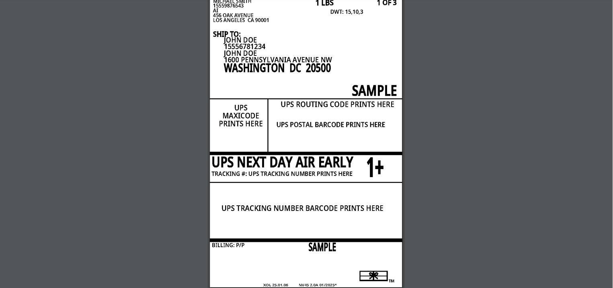

# Easy Guide to ShipEngine with Next.js (Without Creating Custom APIs and ShipEngine SDK)

## Table of Contents

- [Introduction](#introduction)
- [Getting Started](#getting-started)
  - [Prerequisites](#prerequisites)
  - [Installation](#installation)
- [Setting Up ShipEngine](#setting-up-shipengine)
  - [Getting Your Test API Key](#getting-your-test-api-key)
  - [Setting Environment Variables](#setting-environment-variables)
- [Usage](#usage)
  - [Creating Shipment Rates](#creating-shipment-rates)
  - [Generating Labels](#generating-labels)
  - [Tracking Shipments](#tracking-shipments)
- [Conclusion](#conclusion)

---

## Introduction

Hi, I'm **Nadeem Khan**, a passionate **Frontend Developer and Student Leader at GIAIC** with expertise in **Next.js**, **React**, **TypeScript**, **Tailwind CSS**, and **3rd-party integrations**. I thrive on building secure, dynamic, and visually stunning web applications.

🌐 [Portfolio](https://nadeemkhan.vercel.app/)  
💼 [LinkedIn](https://www.linkedin.com/in/nadeem-khan-a083702b9/)  
📧 [Email Me](mailto:nadeemsangrasi903@gmail.com)

## Getting Started

### Prerequisites

Before starting, ensure you have the following installed:

- **Node.js**
- **Next.js**
- **Tailwind CSS**
- **TypeScript**

Make sure you have an active internet connection for installation and subsequent API calls.

### Installation

#### Step 1: Create a Next.js Application

```bash
npx create-next-app@latest my-app
```

## Setting Up ShipEngine

### Getting Your Test API Key

Follow these steps to obtain your ShipEngine test API key:

1. **Create an account** at [ShipEngine](https://www.shipengine.com/).
   
2. Verify your email through the link sent by ShipEngine.
3. Log in to your account.
   
4. Select the free plan.
   
5. On the dashboard, click on "Enable Later" if prompted.
   
6. Copy your API key from the [dashboard](https://dashboard.shipengine.com) or [generate a new API key](https://dashboard.shipengine.com/api-keys).
   

### Setting Environment Variables

Create an `.env.local` file in your project and add the following variables:

```ts
NEXT_PUBLIC_SHIPENGINE_API_KEY = "YOUR_API_KEY";
NEXT_PUBLIC_SHIPENGINE_FIRST_COURIER = "your_first_carrier_code";
NEXT_PUBLIC_SHIPENGINE_SECOND_COURIER = "your_second_carrier_code";
NEXT_PUBLIC_SHIPENGINE_THIRD_COURIER = "your_third_carrier_code";
NEXT_PUBLIC_SHIPENGINE_FOURTH_COURIER = "your_fourth_carrier_code";
```

To get carrier codes, refer to this page:


---

## Usage

### Next.js Configuration Overview

#### Step 1: Add these two functions in your Next.js config

#### Purpose:

- Redirects API requests from your Next.js app to the ShipEngine API.
- Useful when you want to proxy external API calls through your Next.js server.

```typescript
async rewrites() {
  return [
    {
      source: "/api/shipengine/:path*",
      destination: "https://api.shipengine.com/v1/:path*",
    },
  ];
},
async headers() {
  return [
    {
      source: "/api/shipengine/:path*",
      headers: [
        { key: "Access-Control-Allow-Origin", value: "*" },
        {
          key: "API-Key",
          value: process.env.NEXT_PUBLIC_SHIPENGINE_API_KEY || "",
        },
      ],
    },
  ];
},
```

#### Step 2: Simply call the API with required values

In test mode, you can use the address of the country you've selected when creating your account.

Hit the endpoint `api/shipengine/rates`:

##### This endpoint generates rates for your courier

In your frontend:

```typescript
const onSubmit = async (values: z.infer<typeof formSchema>) => {
  try {
    const response = await axios.post(
      `/api/shipengine/rates`,
      {
        rate_options: {
          carrier_ids: [process.env.NEXT_PUBLIC_SHIPENGINE_FIRST_COURIER!],
        },
        shipment: {
          validate_address: "no_validation",
          ship_to: {
            name: values.name,
            phone: values.phone,
            company_name: values.company_name || "",
            address_line1: values.address_line1,
            city_locality: values.city_locality,
            state_province: values.state_province,
            postal_code: values.postal_code,
            country_code: values.country_code,
            address_residential_indicator:
              values.address_residential_indicator || "no",
          },
          ship_from: {
            name: "ShipEngine Team",
            phone: "222-333-4444",
            company_name: "ShipEngine",
            address_line1: "4301 Bull Creek Road",
            city_locality: "Austin",
            state_province: "TX",
            postal_code: "78731",
            country_code: "US",
            address_residential_indicator: "no",
          },
          packages: values.shipment.packages.map((pkg) => ({
            package_code: pkg.package_code,
            weight: {
              value: pkg.weight.value,
              unit: pkg.weight.unit,
            },
          })),
        },
      },
      {
        headers: {
          "Content-Type": "application/json",
          "API-Key": process.env.NEXT_PUBLIC_SHIPENGINE_API_KEY! || "",
        },
      }
    );
    if (response.status !== 200) {
      return;
    }
    console.log(response.data.rate_response.rates);
  } catch (err) {
    const error = err as AxiosError;
    throw new Error(`ShipEngine API error: ${error.message}`);
  }
};
```

#### Example Response


---

### Generating Labels

#### Step 3: Call this endpoint with rate ID to generate labels

Endpoint `api/shipengine/labels/rates/:rate_id`:

##### This endpoint generates labels for your courier

In your frontend:

```typescript
const generateShipmentLabel = async (rateId: string) => {
  try {
    const response = await axios.post(
      `/api/shipengine/labels/rates/${rateId}`,
      {
        label_format: "pdf",
        label_layout: "4x6",
      },
      {
        headers: {
          "Content-Type": "application/json",
          "API-Key": process.env.NEXT_PUBLIC_SHIPENGINE_API_KEY! || "",
        },
      }
    );
    if (response.status !== 200) {
      return;
    }
    console.log(response.data);
  } catch (err) {
    const error = err as AxiosError;
    throw new Error(`ShipEngine API error: ${error.message}`);
  }
};
```

#### Example Label Response


##### Label Image Example



---

### Tracking Shipments

#### Step 4: Call tracking API endpoint with label ID

In test mode, ShipEngine will not track shipments.

In your frontend component:

```typescript
const trackOrder = async (label_id: string) => {
  try {
    const response = await axios.get(
      `http://localhost:3000/api/shipengine/labels/${label_id}/track`,
      {
        headers: {
          "Content-Type": "application/json",
          "API-Key": process.env.NEXT_PUBLIC_SHIPENGINE_API_KEY! || "",
        },
      }
    );
    if (response.status === 200) {
      return response.data;
    }
    return null;
  } catch (error) {
    console.error("Error fetching tracking data:", error);
    return null;
  }
};
```

#### Example Tracking Response

In test mode, ShipEngine will not track shipments.


## Conclusion

This guide helps you set up ShipEngine with your Next.js app, from getting API keys to creating shipments, printing labels, and tracking orders. By following these steps, you can simplify your shipping process. If you have any questions, check out the [ShipEngine Documentation](https://www.shipengine.com/docs/) or contact their support team. Good luck! 😊
